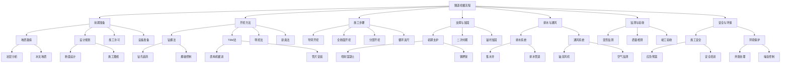

```mermaid
graph TD
    A[隧道挖掘流程] --> B1[前期准备]
    A --> B2[开挖方法]
    A --> B3[施工步骤]
    A --> B4[支撑与加固]
    A --> B5[排水与通风]
    A --> B6[监测与验收]
    A --> B7[安全与环保]

    B1 --> C1_1[地质勘察]
    C1_1 --> D1_1_1[岩层分析]
    C1_1 --> D1_1_2[水文地质]
    B1 --> C1_2[设计规划]
    C1_2 --> D1_2_1[断面设计]
    C1_2 --> D1_2_2[施工图纸]
    B1 --> C1_3[施工许可]
    B1 --> C1_4[设备准备]

    B2 --> C2_1[钻爆法]
    C2_1 --> D2_1_1[钻孔装药]
    C2_1 --> D2_1_2[爆破控制]
    B2 --> C2_2[TBM法]
    C2_2 --> D2_2_1[盾构机掘进]
    C2_2 --> D2_2_2[管片安装]
    B2 --> C2_3[明挖法]
    B2 --> C2_4[新奥法]

    B3 --> C3_1[导洞开挖]
    B3 --> C3_2[全断面开挖]
    B3 --> C3_3[分部开挖]
    B3 --> C3_4[循环进尺]

    B4 --> C4_1[初期支护]
    C4_1 --> D4_1_1[喷射混凝土]
    C4_1 --> D4_1_2[钢拱架]
    B4 --> C4_2[二次衬砌]
    B4 --> C4_3[锚杆加固]

    B5 --> C5_1[排水系统]
    C5_1 --> D5_1_1[集水井]
    C5_1 --> D5_1_2[排水管道]
    B5 --> C5_2[通风系统]
    C5_2 --> D5_2_1[轴流风机]
    C5_2 --> D5_2_2[空气监测]

    B6 --> C6_1[变形监测]
    B6 --> C6_2[质量检测]
    B6 --> C6_3[竣工验收]

    B7 --> C7_1[施工安全]
    C7_1 --> D7_1_1[应急预案]
    C7_1 --> D7_1_2[安全培训]
    B7 --> C7_2[环境保护]
    C7_2 --> D7_2_1[弃渣处理]
    C7_2 --> D7_2_2[噪音控制]
```